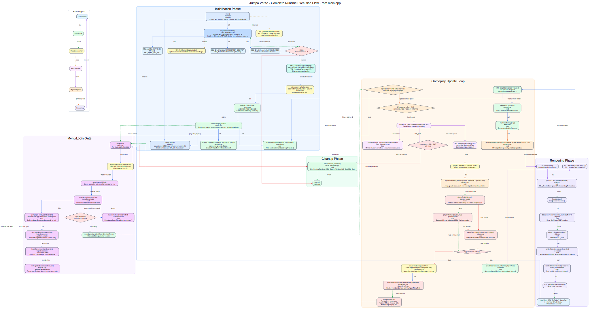
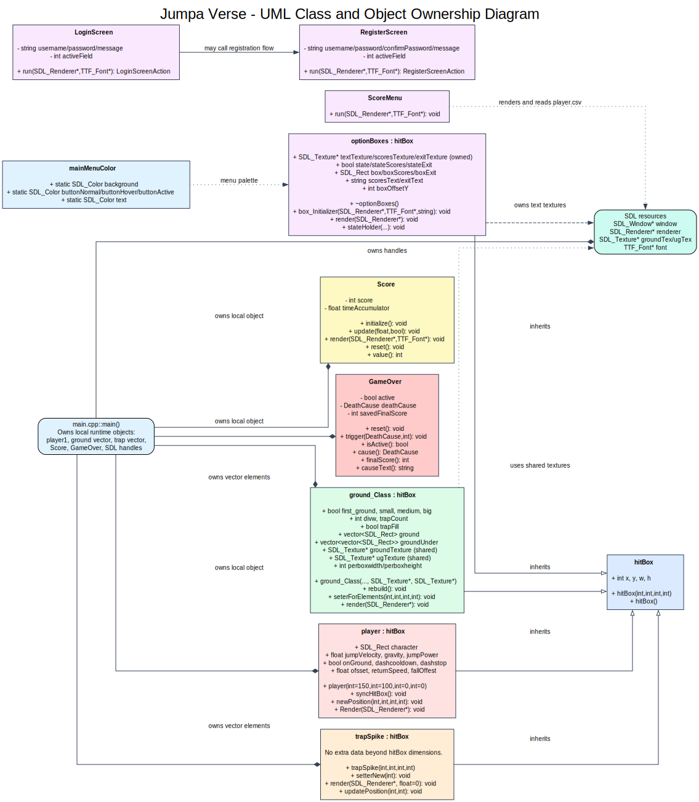
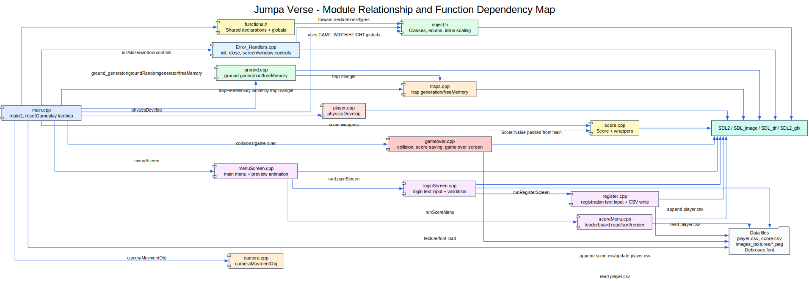
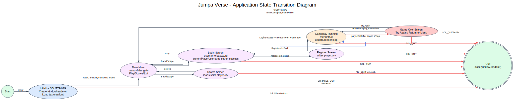
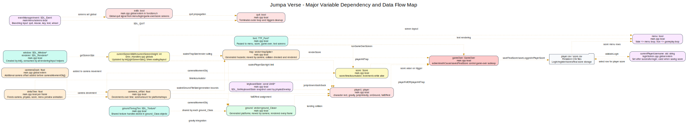

# Jumpa Verse C++/SDL2 Execution Flowchart and Software Execution Map

Project root: `/home/error_343/Desktop/Jumpa-Verse`  
Entry point: `main.cpp -> int main()`  
Source files scanned: `main.cpp`, `object.h`, `functions.h`, `object.cpp`, `Error_Handlers.cpp`, `ground.cpp`, `traps.cpp`, `camera.cpp`, `player.cpp`, `score.cpp`, `gameover.cpp`, `menuScreen.cpp`, `loginScreen.cpp`, `register.cpp`, `scoreMenu.cpp`

## 1. Full Runtime Flowchart



**Figure 1.** Complete execution path beginning at `main.cpp::main()`. Blue arrows represent function calls, dashed green arrows represent return flow, dotted yellow arrows represent data dependencies, purple arrows represent input/render paths, orange arrows represent update/physics paths, and red arrows represent exit or game-over branches.

The program starts in `main.cpp`, initializes SDL subsystems and resources, opens the menu/login gate, then enters a cyclic gameplay loop. A normal frame follows this order:

```cpp
Uint32 currentTime = SDL_GetTicks();
float deltaTime = (currentTime - lastTime) / 1000.0f;
lastTime = currentTime;
...
while (SDL_PollEvent(&eventManager) != 0) { ... }
const Uint8* keyboardState = SDL_GetKeyboardState(NULL);
physicsDevelop(player1, ground, deltaTime, keyboardState);
...
SDL_RenderClear(renderer);
cameraMovmentObj(ground, cammera_offSet + cammeraDash, trap);
ground[j].render(renderer);
trap[j].render(renderer);
player1.Render(renderer);
renderScore(score, renderer, font);
SDL_RenderPresent(renderer);
```

## 2. Game Loop Architecture

The outer `while (!quit)` loop in `main.cpp` is the application lifecycle loop. Inside it, `while (!menu && !quit)` blocks gameplay until `menuScreen()` returns `true`. Once the player has logged in successfully, the game advances through fixed frame phases:

1. Timing: `SDL_GetTicks()` calculates `deltaTime`; values above `0.05f` are clamped.
2. Menu gate: `menuScreen(renderer, font)` may call login, register, score menu, or exit.
3. Input events: `SDL_PollEvent()` handles SDL quit and custom window controls.
4. Continuous input: `SDL_GetKeyboardState(NULL)` feeds movement keys into physics.
5. Physics/update: `physicsDevelop()` updates jump velocity, gravity, x/y motion, platform landing, and hitbox synchronization.
6. Failure checks: `playerFellOff()` and `playerHitTrap()` may trigger `GameOver`.
7. Score update: `updateScore()` increments score once per accumulated second while alive.
8. World update: `groundRandomgenerator()`, `freeMemory()`, `trapFreeMemory()`, and `cameraMovmentObj()` maintain scrolling terrain.
9. Rendering: ground, traps, player, score, and window controls render before `SDL_RenderPresent()`.
10. Frame limiting: `SDL_Delay()` limits the loop to about 60 FPS.

## 3. UML Class and Ownership Diagram



**Figure 2.** UML-style diagram of inheritance, composition, local ownership, shared SDL resources, and screen classes. `main()` owns the major runtime objects locally; `ground_Class` stores shared texture pointers and does not destroy them.

## 4. Module Relationship Diagram



**Figure 3.** File/module dependency map. `functions.h` provides shared declarations and globals. `object.h` defines data types and inline methods. `main.cpp` orchestrates the runtime through the implementation modules.

## 5. State Transition Diagram



**Figure 4.** Program states and transitions: initialization, main menu, login, register, scores, gameplay, game over, and cleanup. `exitb` is a cross-screen quit signal used by menu, score, login, and game-over flows.

## 6. Variable Dependency Map



**Figure 5.** Major runtime variables and data dependencies. The most important flows are screen size into layout/scaling, keyboard state into `player`, `ground` into platform collision, `trap` into hazard collision, and `Score/GameOver/currentPlayerUsername` into CSV persistence.

## 7. Function Call Hierarchy From `main()`

`main.cpp::main()` calls:

- `init(window, renderer)` -> `SDL_Init`, `TTF_Init`, `IMG_Init`, `SDL_GetCurrentDisplayMode`, `SDL_CreateWindow`, `SDL_CreateRenderer`, `SDL_SetWindowMinimumSize`
- `IMG_LoadTexture(renderer, ...)` for ground and underground textures
- `TTF_OpenFont(...)` for the main UI font
- `initializeScore(score)` -> `Score::initialize()` -> `Score::reset()`
- `resetGameplay()` lambda -> `player()`, `ground_generator()`, `groundRandomgenerator()`, `resetScore()`, `GameOver::reset()`
- `menuScreen(renderer, font)` -> `openLoginForPlay()` -> `runLoginScreen()` -> `LoginScreen::run()` -> optional `runRegisterScreen()` -> `RegisterScreen::run()`
- `menuScreen(renderer, font)` -> optional `runScoreMenu()` -> `ScoreMenu::run()`
- `handleWindowControlEvent(renderer, eventManager)` during gameplay event polling
- `SDL_GetKeyboardState(NULL)` for continuous movement input
- `physicsDevelop(player1, ground, deltaTime, keyboardState)`
- `playerFellOff(player1)` and `playerHitTrap(player1, trap)`
- `gameOver.trigger(...)`, `gameOver.isActive()`, `score.value()`
- `saveFinalScore(gameOver)`, `saveLoggedInPlayerScore(gameOver)`, `runGameOverScreen(renderer, font, gameOver)`
- `updateScore(score, deltaTime, playerAlive)`
- `groundRandomgenerator(...)`, `freeMemory(ground)`, `trapFreeMemory(trap)`, `cameraMovmentObj(ground, ..., trap)`
- `ground_Class::render(renderer)`, `trapSpike::render(renderer)`, `player::Render(renderer)`, `renderScore(score, renderer, font)`, `renderWindowControls(renderer)`
- `close(window, renderer)` -> `SDL_DestroyRenderer`, `SDL_DestroyWindow`, `IMG_Quit`, `SDL_Quit`

## 8. Function Inventory

| Function | File | Class | Parameters | Return | Purpose and modified data |
|---|---|---|---|---|---|
| `main` | `main.cpp` | none | none | `int` | Entry point. Owns SDL handles, player, terrain vectors, score, game-over state, menu/game loop control, and cleanup. |
| `resetGameplay` | `main.cpp` | lambda | captures locals by reference | `auto/void` | Reinitializes player, camera offset, ground/trap vectors, score, and game-over state for a fresh run. |
| `init` | `Error_Handlers.cpp` | none | `SDL_Window*& Window`, `SDL_Renderer*& renderer` | `bool` | Initializes SDL video, TTF, JPG loading, display size, window, renderer. Modifies `Window`, `renderer`, `currentScreenWidth`, `currentScreenHeight`. |
| `close` | `Error_Handlers.cpp` | none | `SDL_Window* window`, `SDL_Renderer* renderer` | `void` | Destroys renderer/window and shuts down IMG/SDL. |
| `getScreenSize` | `Error_Handlers.cpp` | none | `SDL_Renderer* renderer`, `int& screenW`, `int& screenH` | `void` | Reads renderer output size and updates global screen dimensions. |
| `handleWindowControlEvent` | `Error_Handlers.cpp` | none | `SDL_Renderer* renderer`, `const SDL_Event& event` | `bool` | Handles custom minimize/fullscreen buttons. May call `SDL_MinimizeWindow`, `SDL_SetWindowFullscreen`, `SDL_SetWindowSize`, `SDL_SetWindowPosition`. |
| `renderWindowControls` | `Error_Handlers.cpp` | none | `SDL_Renderer* renderer` | `void` | Draws custom minimize/fullscreen buttons. |
| `scaledGroundTileSize` | `object.h` | none inline | none | `int` | Returns terrain tile size based on `currentScreenWidth`. |
| `scaledTrapSize` | `object.h` | none inline | none | `int` | Returns trap size based on `currentScreenWidth`. |
| `scaledPlayerSize` | `object.h` | none inline | none | `int` | Returns player size based on `currentScreenWidth`. |
| `toUpperUsername` | `functions.h` | none inline | `const std::string& username` | `std::string` | Normalizes usernames for case-insensitive comparison. |
| `hitBox::hitBox` | `object.h` | `hitBox` | `int x`, `int y`, `int w`, `int h` | constructor | Stores rectangle-like bounds. |
| `ground_Class::ground_Class` | `object.h` | `ground_Class` | `int ax`, `int ay`, `int aw`, `int ah`, `SDL_Texture* groundTex`, `SDL_Texture* ugTex` | constructor | Initializes platform bounds and shared texture pointers, then calls `rebuild()`. |
| `ground_Class::rebuild` | `object.h` | `ground_Class` | none | `void` | Rebuilds tile rectangles in `ground` and `groundUnder` after position/size changes. |
| `ground_Class::seterForElements` | `object.h` | `ground_Class` | `int newX`, `int newY`, `int newW`, `int newH` | `void` | Updates platform bounds and rebuilds geometry. Used by camera movement. |
| `ground_Class::render` | `object.h` | `ground_Class` | `SDL_Renderer* renderer` | `void` | Renders top ground tiles and underground tiles using shared textures. |
| `trapSpike::setterNew` | `object.h` | `trapSpike` | `int x` | `void` | Updates trap x coordinate during camera movement. |
| `trapSpike::render` | `object.h` | `trapSpike` | `SDL_Renderer* renderer`, `float cameraOffset=0` | `void` | Draws a triangle trap with SDL2_gfx, skipping far-offscreen traps. |
| `trapSpike::updatePosition` | `object.h` | `trapSpike` | `int x`, `int y` | `void` | Updates trap position. |
| `player::player` | `object.h` | `player` | `int sx=150`, `int sy=100`, `int sw=0`, `int sh=0` | constructor | Initializes player hitbox and `SDL_Rect character`; uses scaled size when width/height are zero. |
| `player::syncHitBox` | `object.h` | `player` | none | `void` | Copies `character` rectangle data into inherited hitbox fields. |
| `player::newPosition` | `object.h` | `player` | `int nx`, `int ny`, `int nw`, `int nh` | `void` | Sets `character` and synchronizes hitbox. |
| `player::Render` | `object.h` | `player` | `SDL_Renderer* renderer` | `void` | Draws the player rectangle. |
| `GameOver::GameOver` | `object.cpp` | `GameOver` | none | constructor | Calls `reset()`. |
| `GameOver::reset` | `object.cpp` | `GameOver` | none | `void` | Clears active state, death cause, and saved score. |
| `GameOver::trigger` | `object.cpp` | `GameOver` | `DeathCause cause`, `int score` | `void` | Activates game-over state and stores cause/final score. |
| `GameOver::isActive` | `object.cpp` | `GameOver` | none | `bool` | Returns whether game-over mode is active. |
| `GameOver::cause` | `object.cpp` | `GameOver` | none | `DeathCause` | Returns the stored death cause. |
| `GameOver::finalScore` | `object.cpp` | `GameOver` | none | `int` | Returns the captured final score. |
| `GameOver::causeText` | `object.cpp` | `GameOver` | none | `std::string` | Converts death cause enum into display text. |
| `optionBoxes::box_Initializer` | `object.h` | `optionBoxes` | `SDL_Renderer*`, `TTF_Font*`, `std::string text` | `void` | Creates menu button text textures, destroying older textures first. |
| `optionBoxes::render` | `object.h` | `optionBoxes` | `SDL_Renderer* renderer` | `void` | Draws Play/Scores/Exit boxes and text textures. |
| `optionBoxes::stateHolder` | `object.h` | `optionBoxes` | renderer, font, text, `bool stat`, `bool scores`, `bool exit` | `void` | Updates selection flags and regenerates button textures. |
| `ground_generator` | `ground.cpp` | none | `SDL_Renderer* renderer`, `SDL_Texture* groundTex`, `SDL_Texture* ugTex` | `std::vector<ground_Class>` | Creates the first random platform and marks it as `first_ground`. |
| `groundRandomgenerator` | `ground.cpp` | none | renderer, textures, `std::vector<ground_Class>& prevGround`, `std::vector<trapSpike>& trap` | `void` | Appends a random platform after the last platform, classifies size, and calls `trapTriangle()` up to platform-specific count. |
| `freeMemory` | `ground.cpp` | none | `std::vector<ground_Class>& ground` | `void` | Erases platforms that have fully moved left of screen. |
| `dualPath` | `ground.cpp` | none | `std::vector<ground_Class>& ground`, textures | `void` | Uncalled experimental helper; currently creates RNG distributions but does not modify gameplay. |
| `trapTriangle` | `traps.cpp` | none | renderer, `std::vector<trapSpike>& trap`, `std::vector<ground_Class>& ground`, `int i`, `int maxTraps` | `void` | Randomly places non-overlapping traps on a platform and increments platform `trapCount`. |
| `trapFreeMemory` | `traps.cpp` | none | `std::vector<trapSpike>& trap` | `void` | Erases traps far off the left side. |
| `cameraMovmentObj` | `camera.cpp` | none | `std::vector<ground_Class>& ground`, `float cameraOffset`, `std::vector<trapSpike>& trap` | `void` | Converts offset to int and shifts every platform/trap horizontally. |
| `physicsDevelop` | `player.cpp` | none | `player& player1`, `std::vector<ground_Class>& g1`, `float deltaTime`, `const Uint8* keyboardState` | `void` | Reads keyboard/mouse state, applies jump/gravity/dash/back movement, detects landing on platforms, syncs hitbox. |
| `Score::initialize` | `score.cpp` | `Score` | none | `void` | Calls `reset()`. |
| `Score::update` | `score.cpp` | `Score` | `float deltaTime`, `bool playerAlive` | `void` | Accumulates time and increments score each second while player is alive. |
| `Score::render` | `score.cpp` | `Score` | `SDL_Renderer* renderer`, `TTF_Font* font` | `void` | Creates text textures, draws score panel, destroys per-frame text textures. |
| `Score::reset` | `score.cpp` | `Score` | none | `void` | Sets score and time accumulator to zero. |
| `Score::value` | `score.cpp` | `Score` | none | `int` | Returns current score. |
| `initializeScore` | `score.cpp` | none | `Score& score` | `void` | Wrapper around `Score::initialize()`. |
| `updateScore` | `score.cpp` | none | `Score& score`, `float deltaTime`, `bool playerAlive` | `void` | Wrapper around `Score::update()`. |
| `renderScore` | `score.cpp` | none | `Score& score`, renderer, font | `void` | Wrapper around `Score::render()`. |
| `resetScore` | `score.cpp` | none | `Score& score` | `void` | Wrapper around `Score::reset()`. |
| `playerFellOff` | `gameover.cpp` | none | `const player& player1`, `int fallY=-1` | `bool` | Returns true if player y passes fall threshold. |
| `playerHitTrap` | `gameover.cpp` | none | `const player& player1`, `const std::vector<trapSpike>& trap` | `bool` | Checks player rectangle against each visible trap rectangle. |
| `saveFinalScore` | `gameover.cpp` | none | `const GameOver& gameOver`, `const std::string& path="score.csv"` | `void` | Appends final score to `score.csv`. |
| `saveLoggedInPlayerScore` | `gameover.cpp` | none | `const GameOver& gameOver`, `const std::string& path="player.csv"` | `void` | Finds current user row and appends final score to that CSV line. |
| `runGameOverScreen` | `gameover.cpp` | none | `SDL_Renderer* renderer`, `TTF_Font* font`, `GameOver& gameOver` | `GameOverAction` | Runs modal game-over event/render loop and returns Try Again/Menu/None. |
| `menuScreen` | `menuScreen.cpp` | none | `SDL_Renderer* renderer`, `TTF_Font* font` | `bool` | Runs main menu loop, handles Play/Scores/Exit, renders preview animation and menu buttons. |
| `runLoginScreen` | `loginScreen.cpp` | none | renderer, font | `LoginScreenAction` | Constructs `LoginScreen` and calls `run()`. |
| `LoginScreen::run` | `loginScreen.cpp` | `LoginScreen` | renderer, font | `LoginScreenAction` | Runs login text input loop, validates credentials, may launch registration. |
| `runRegisterScreen` | `register.cpp` | none | renderer, font | `RegisterScreenAction` | Constructs `RegisterScreen` and calls `run()`. |
| `RegisterScreen::run` | `register.cpp` | `RegisterScreen` | renderer, font | `RegisterScreenAction` | Runs registration text input loop and writes player credentials to CSV. |
| `runScoreMenu` | `scoreMenu.cpp` | none | renderer, font | `void` | Constructs `ScoreMenu` and calls `run()`. |
| `ScoreMenu::run` | `scoreMenu.cpp` | `ScoreMenu` | renderer, font | `void` | Reads, sorts, scrolls, and renders leaderboard rows from `player.csv`. |

## 9. Anonymous/Helper Function Inventory

| Helper | File | Parameters | Return | Purpose |
|---|---|---|---|---|
| `clampInt` | `ground.cpp` anonymous namespace | `int value`, `int minValue`, `int maxValue` | `int` | Clamps procedural terrain dimensions to screen-safe bounds. |
| `trapVisibleHitbox` | `gameover.cpp` anonymous namespace | `const trapSpike& trap` | `SDL_Rect` | Converts trap base position into visible triangular collision box. |
| `rectsOverlap` | `gameover.cpp` anonymous namespace | `const SDL_Rect& a`, `const SDL_Rect& b` | `bool` | Calls `SDL_HasIntersection()` for collision checks. |
| `renderText` | `gameover.cpp` anonymous namespace | renderer, font, text, color, bounds | `void` | Scales and renders text inside a target rectangle. |
| `pointInside` | `gameover.cpp`, `loginScreen.cpp`, `register.cpp`, `scoreMenu.cpp` anonymous namespaces | `const SDL_Rect& rect`, `int x`, `int y` | `bool` | Hit-tests mouse coordinates against UI rectangles. |
| `renderGameOver` | `gameover.cpp` anonymous namespace | renderer, font, `const GameOver&`, `int selectedButton` | `void` | Renders the complete game-over screen and buttons. |
| `openLoginForPlay` | `menuScreen.cpp` anonymous namespace | renderer, font | `bool` | Launches login before gameplay; maps quit to `exitb`. |
| `openFont` | `loginScreen.cpp`, `register.cpp`, `scoreMenu.cpp` anonymous namespaces | `int size`, `TTF_Font* fallback` | `TTF_Font*` | Opens the Debrosee font with fallback to caller font. |
| `drawText` | `loginScreen.cpp`, `register.cpp`, `scoreMenu.cpp` anonymous namespaces | renderer, font, text, color, bounds, center | `void` | Creates a temporary text texture, scales it, renders it, then destroys it. |
| `drawButton` | `loginScreen.cpp`, `register.cpp` anonymous namespaces | renderer, font, rect, text, selected | `void` | Draws a filled UI button and text. |
| `drawInput` | `loginScreen.cpp`, `register.cpp` anonymous namespaces | renderer, label font, input font, rect, label, value, password, active | `void` | Draws text input labels, boxes, borders, and current value. |
| `validateLogin` | `loginScreen.cpp` anonymous namespace | username, password, message | `bool` | Reads `player.csv` and validates user credentials. |
| `usernameExists` | `register.cpp` anonymous namespace | username | `bool` | Scans `player.csv` for existing username. |
| `registerPlayer` | `register.cpp` anonymous namespace | username, password, confirmPassword, message | `bool` | Validates registration and appends `username,password,0` to `player.csv`. |
| `readPlayerScores` | `scoreMenu.cpp` anonymous namespace | none | `std::vector<PlayerScoreRow>` | Reads all users and highest score from `player.csv`, then sorts descending. |

## 10. Important Variable Inventory

| Variable | Type | File | Scope | Stores | Behavioral effect |
|---|---|---|---|---|---|
| `cammeraDash` | `float` | `main.cpp` | global | Additional camera movement offset | Added to `cammera_offSet` before `cameraMovmentObj()`. |
| `exitb` | `bool` | `main.cpp` | global | Cross-screen exit flag | Set by menu/score/game-over/login flows; causes `quit=true`. |
| `currentScreenWidth` | `int` | `Error_Handlers.cpp` | global | Current renderer/display width | Drives scaling, terrain generation, UI layout, render culling. |
| `currentScreenHeight` | `int` | `Error_Handlers.cpp` | global | Current renderer/display height | Drives fall threshold, terrain bounds, UI layout. |
| `currentPlayerUsername` | `std::string` | `loginScreen.cpp` | global | Logged-in username | Used by `saveLoggedInPlayerScore()` to append user score. |
| `window` | `SDL_Window*` | `main.cpp` | local | SDL window handle | Created by `init()`, destroyed by `close()`. |
| `renderer` | `SDL_Renderer*` | `main.cpp` | local | SDL renderer handle | Passed to almost every render/input helper. |
| `player1` | `player` | `main.cpp` | local object | Current player rectangle and physics state | Mutated by `physicsDevelop()`, rendered by `player::Render()`, checked by collision helpers. |
| `cammera_offSet` | `float` | `main.cpp` | local | Scrolling camera illusion amount | Decreases over time and shifts platforms/traps. |
| `groundTex` | `SDL_Texture*` | `main.cpp` | local | Ground tile texture | Shared by `ground_Class`; no per-platform texture ownership. |
| `ugTex` | `SDL_Texture*` | `main.cpp` | local | Underground tile texture | Shared by `ground_Class`. |
| `font` | `TTF_Font*` | `main.cpp` | local | Primary UI font | Passed to menu/login/score/game-over renderers. |
| `trap` | `std::vector<trapSpike>` | `main.cpp` | local | Active trap objects | Appended by `trapTriangle()`, moved by camera, checked by `playerHitTrap()`. |
| `ground` | `std::vector<ground_Class>` | `main.cpp` | local | Active platform objects | Generated procedurally, moved by camera, used for landing collision and rendering. |
| `score` | `Score` | `main.cpp` | local object | Current score state | Updated every frame; captured when death occurs. |
| `gameOver` | `GameOver` | `main.cpp` | local object | Active game-over state, death cause, final score | Controls transition into game-over screen. |
| `quit` | `bool` | `main.cpp` | local | Main loop termination flag | Ends outer loop and triggers cleanup. |
| `menu` | `bool` | `main.cpp` | local | Whether gameplay is unlocked | `false` enters menu loop; `true` runs gameplay. |
| `eventManager` | `SDL_Event` | `main.cpp` | local | Current gameplay SDL event | Used for SDL quit and window controls. |
| `lastTime` | `Uint32` | `main.cpp` | local | Previous frame tick | Used to compute `deltaTime`. |
| `deltaTime` | `float` | `main.cpp` | local per frame | Seconds since last frame | Controls physics integration, camera speed, score update. |
| `targetFrameTime` | `const float` | `main.cpp` | local | 16.67 ms target frame duration | Used by `SDL_Delay()` for 60 FPS cap. |
| `keyboardState` | `const Uint8*` | `main.cpp` | local per frame | SDL keyboard state snapshot | Feeds jump/down/dash/back controls into `physicsDevelop()`. |
| `jumpVelocity` | `float` | `object.h` | `player` member | Vertical velocity | Integrated by gravity and applied to `character.y`. |
| `gravity` | `float` | `object.h` | `player` member | Gravity acceleration | Increased while down/right-click is held; reset to 1800 otherwise. |
| `jumpPower` | `float` | `object.h` | `player` member | Initial upward velocity | Assigned to `jumpVelocity` when jumping from ground. |
| `onGround` | `bool` | `object.h` | `player` member | Whether player is standing on platform | Required for jump; set by platform collision. |
| `character` | `SDL_Rect` | `object.h` | `player` member | Player render/collision rectangle | Main mutable player body. |
| `first_ground` | `bool` | `object.h` | `ground_Class` member | Marks starting platform | Prevents trap placement on the first platform. |
| `trapCount` | `int` | `object.h` | `ground_Class` member | Number of traps placed on platform | Prevents exceeding `maxTraps`. |
| `groundTexture`, `ugTexture` | `SDL_Texture*` | `object.h` | `ground_Class` members | Shared texture pointers | Used by `ground_Class::render()`, not destroyed by the class. |
| `score` | `int` | `object.h` | `Score` private member | Player score value | Displayed and saved on death. |
| `timeAccumulator` | `float` | `object.h` | `Score` private member | Elapsed time toward next point | Adds 1 score when it reaches 1 second. |
| `active` | `bool` | `object.h` | `GameOver` private member | Game-over status | Controls `runGameOverScreen()` loop. |
| `deathCause` | `DeathCause` | `object.h` | `GameOver` private member | Cause of death | Rendered as text on game-over screen. |
| `savedFinalScore` | `int` | `object.h` | `GameOver` private member | Final score at death | Written to CSV files. |

## 11. SDL Initialization and Renderer Creation

`init()` is the only initialization function called directly by `main()`. It performs:

1. `SDL_Init(SDL_INIT_VIDEO)` to enable video.
2. `TTF_Init()` to enable font rendering.
3. `IMG_Init(IMG_INIT_JPG)` to enable JPG texture loading.
4. `SDL_GetCurrentDisplayMode(0, &displayMode)` to initialize screen globals.
5. `SDL_CreateWindow("Jumpa Verse", ..., SDL_WINDOW_FULLSCREEN_DESKTOP | SDL_WINDOW_RESIZABLE)`.
6. `SDL_CreateRenderer(Window, -1, SDL_RENDERER_ACCELERATED)`.
7. `SDL_SetWindowMinimumSize(Window, 960, 540)`.

If any required subsystem/window/renderer creation fails, `init()` returns `false`, and `main()` returns `-1`.

## 12. Texture Loading and Rendering Flow

Texture loading happens in `main()` after successful initialization:

```cpp
SDL_Texture* groundTex = IMG_LoadTexture(renderer, "Images_textures/ground.jpeg");
SDL_Texture* ugTex = IMG_LoadTexture(renderer, "Images_textures/underGround.jpeg");
TTF_Font *font = TTF_OpenFont("debrosee-font/Debrosee-ALPnL.ttf", 100);
```

`groundTex` and `ugTex` are passed into generated `ground_Class` objects. Each platform stores those pointers as shared resources and uses them in `ground_Class::render()`. Text rendering in menu, login, register, score, and game-over screens creates temporary `SDL_Surface*` and `SDL_Texture*` objects, then frees/destroys them after rendering.

## 13. Input Handling Flow

Gameplay input has two layers:

- Event-based input: `SDL_PollEvent()` catches `SDL_QUIT` and routes mouse clicks through `handleWindowControlEvent()`.
- Continuous input: `SDL_GetKeyboardState(NULL)` feeds `physicsDevelop()`.

`physicsDevelop()` maps:

- Jump: `SPACE`, `W`, `UP`, or left mouse button.
- Fast fall: `LCTRL`, `S`, `DOWN`, or right mouse button.
- Right movement/dash: `LSHIFT`, `D`, `RIGHT`.
- Left movement: `A`, `LEFT`, `LALT`.

Menu, login, register, score, and game-over screens each run their own SDL event loop while active. This means those screens are modal: gameplay does not update while a screen loop is active.

## 14. Physics, Collision, and Update Flow

`physicsDevelop()` is the main physics function. It:

1. Returns early if `deltaTime <= 0.0f`.
2. Reads mouse buttons and keyboard state.
3. Applies jump only when `player1.onGround` is true.
4. Temporarily increases gravity during fast-fall input.
5. Moves the player horizontally with screen-bound clamping.
6. Applies gravity to `jumpVelocity`.
7. Applies vertical velocity to `player1.character.y`.
8. Iterates through platforms and checks whether the player crossed the platform top from above.
9. Snaps the player to the platform top, clears velocity, and sets `onGround=true`.
10. Calls `player1.syncHitBox()`.

Trap collision is separate. `playerHitTrap()` builds a visible trap rectangle from each `trapSpike` and checks `SDL_HasIntersection()` with `player1.character`.

## 15. Procedural World Generation and Camera Flow

`ground_generator()` creates the initial platform. `groundRandomgenerator()` appends later platforms based on the last platform's position, screen size, random y/width/height, and bounded gaps. Platform width classification controls trap count:

- Small platform: up to 1 trap.
- Medium platform: up to 3 traps.
- Big platform: up to 6 traps.

`trapTriangle()` attempts randomized placement with overlap spacing checks. `freeMemory()` removes platforms fully left of screen, and `trapFreeMemory()` removes traps far left of screen. `cameraMovmentObj()` shifts platform and trap x positions using `cammera_offSet + cammeraDash`.

## 16. Audio and Animation System Notes

No SDL_mixer or other audio subsystem usage was found in the scanned `.cpp` and `.h` files. There is no active audio system in the current source.

The project does not contain a sprite-sheet animation class. The visible animation systems are procedural:

- Gameplay scrolling is simulated by moving platforms/traps horizontally.
- Menu preview animation simulates a cube jumping over generated triangle traps.
- Text/UI hover states update through button selection flags and regenerated textures.

## 17. Memory Management and Resource Cleanup

Managed resources:

- `optionBoxes::~optionBoxes()` destroys its owned text textures.
- Text helper functions destroy temporary text textures and free temporary surfaces.
- `Score::render()` destroys score text textures each frame.
- Login/register/score screens close fonts they opened when those fonts are not the caller-provided fallback.
- `close()` destroys renderer/window and quits IMG/SDL.

Important resource caveats:

- `groundTex`, `ugTex`, and the main `font` are loaded in `main()` but are not explicitly destroyed/closed before `close()`.
- `Score::render()` uses static font pointers and does not close them.
- `renderGameOver()` uses a static digit font and does not close it.
- `TTF_Quit()` is not called in `close()`, although `TTF_Init()` is called in `init()`.

These are cleanup risks rather than immediate gameplay flow blockers.

## 18. Object Interaction Summary

- `main()` owns `player1`, `ground`, `trap`, `score`, `gameOver`, `window`, `renderer`, textures, and font.
- `ground_Class` objects reference shared textures from `main()` and rebuild internal tile rectangles when moved.
- `trapSpike` objects are generated from platform data and stored in the `trap` vector.
- `physicsDevelop()` reads `ground` and mutates `player1`.
- `playerHitTrap()` reads `trap` and `player1`.
- `GameOver` stores the result of a death event and controls the game-over modal loop.
- `Score` is updated only when `gameOver` is inactive.
- Login and score persistence depend on `player.csv`; final score persistence also writes `score.csv`.

## 19. Runtime Order Summary

```text
main()
  -> init()
  -> load textures/font
  -> construct Score/GameOver/vectors
  -> initializeScore()
  -> resetGameplay()
       -> player()
       -> ground_generator()
       -> groundRandomgenerator()
       -> resetScore()
       -> GameOver::reset()
  -> while !quit
       -> calculate deltaTime
       -> while !menu
            -> menuScreen()
                 -> Play: runLoginScreen() -> LoginScreen::run()
                       -> optional runRegisterScreen() -> RegisterScreen::run()
                 -> Scores: runScoreMenu() -> ScoreMenu::run()
                 -> Exit: exitb=true
            -> resetGameplay()
       -> poll gameplay events
       -> SDL_GetKeyboardState()
       -> physicsDevelop()
       -> playerFellOff() / playerHitTrap()
       -> optional GameOver handling
       -> updateScore()
       -> generate/free/move world objects
       -> render ground/traps/player/score/window controls
       -> SDL_RenderPresent()
       -> frame delay/FPS print
  -> close()
  -> return 0
```

## 20. Deliverable Files

- `docs_report/execution_map/JumpaVerse_Execution_Map.md` - this full documentation file.
- `docs_report/execution_map/diagrams/*.dot` - editable Graphviz diagram sources.
- `docs_report/execution_map/diagrams/*.svg` - scalable, high-quality diagrams.
- `docs_report/execution_map/diagrams/*.png` - raster exports for submission systems that require images.

